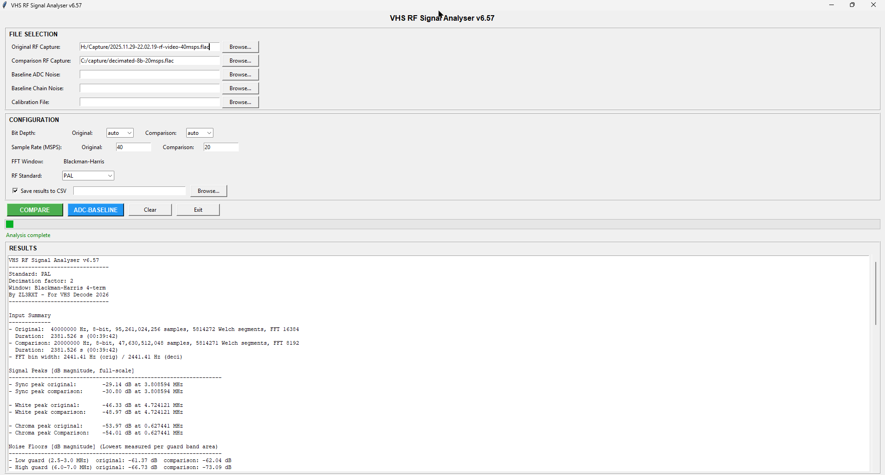
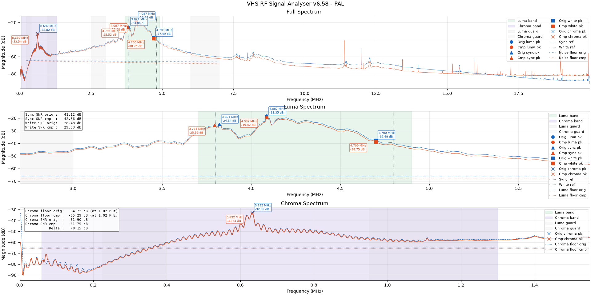
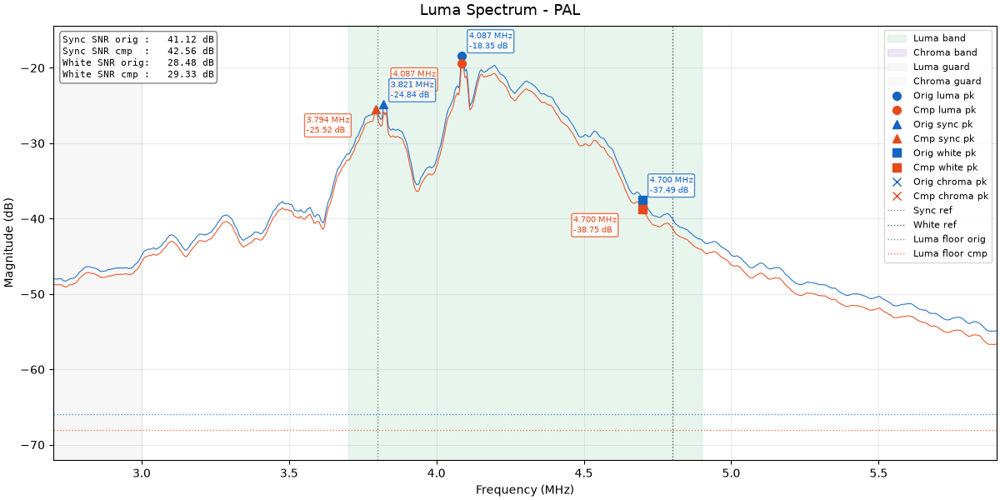
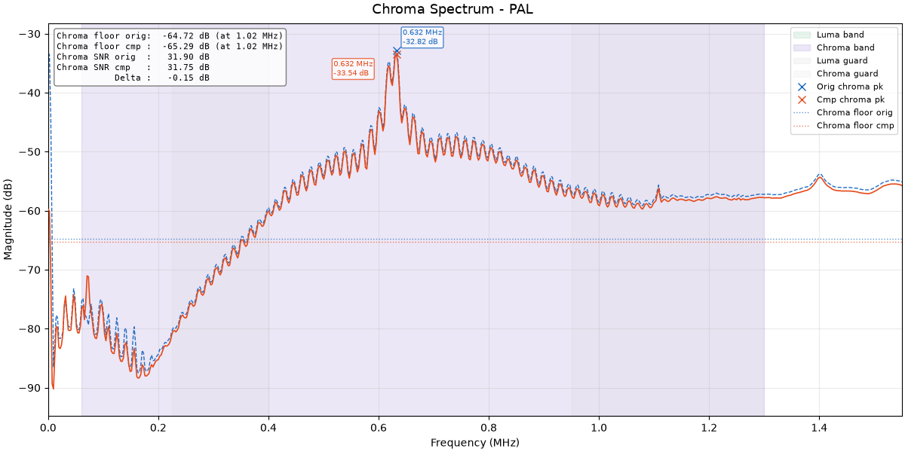

# VHS-RF-Signal-Analyser
Compares two VHS RF capture files and measures signal. 


## Features
- Luma and chroma carrier frequency measurement
- Noise floor detection using guard-band analysis around Luminance and Chroma Signals
- Signal-to-noise ratio (SNR) for sync, white, and chroma carriers
- VHS spec reference comparison
- Equivalent SNR bits indicating capture chain quality indicator
- Spectral plots with noise floor overlay
- Works with raw (.u16, .s16, .8bit) or FLAC ADC captures
- Auto-detects sample rate from FLAC metadata
- Supports NTSC, PAL, M-PAL, N-PAL
- CSV and JSON export for further analysis
- Baseline profile the VCR, Capture device and signal path
- PNG spectrum plot auto-saved alongside input file

## Example Output
Example of a hsdaoh 40 MSPS 16-bit capture before and after
swapping out AD8138 with LT6600-10 opamp w/integrated Chebyshev Low Pass Filter.






## Why use this and what can this tool help with?
- Is your RF capture achieving the best possible signal-to-noise ratio?
- How does your capture setup compare against anothers?
- Is your capture device or VCR performing correctly?
- Are your capture settings, hardware modifications, and RF gain optimised?
- Is an analogue low-pass filter improving or degrading the capture quality?
- Is the RF head tap providing the best possible signal?
- Is an RF amplifier required, and is it configured correctly?
- What is the condition of the VCR video heads?
- Does decimation improve the captured RF signal-to-noise ratio?
- Does downsampling or resampling reduce recoverable signal quality?
- Does decimation improve captured RF signal-to-noise ratio?

## Example Report
```text
Signal Peaks [dB magnitude, full-scale]
------------------------------------------------------------------
- Sync peak original:        -29.14 dB at 3.808594 MHz
- Sync peak comparison:      -30.80 dB at 3.808594 MHz

- White peak original:       -46.33 dB at 4.724121 MHz
- White peak comparison:     -48.97 dB at 4.724121 MHz

- Chroma peak original:      -53.97 dB at 0.627441 MHz
- Chroma peak Comparison:    -54.01 dB at 0.627441 MHz

Noise Floors [dB magnitude] (Lowest measured per guard band area)
------------------------------------------------------------------
- Low guard (2.5-3.0 MHz)  original: -61.37 dB  comparison: -62.04 dB
- High guard (6.0-7.0 MHz) original: -66.73 dB  comparison: -73.09 dB
- Guard tilt original: -5.36 dB  comparison: -11.05 dB

+ Sync floor original:       -66.73 dB  (at 7.00 MHz)
- Sync floor comparison:     -73.09 dB  (at 7.00 MHz)

+ White floor original:      -66.73 dB  (at 7.00 MHz)
- White floor comparison:    -73.09 dB  (at 7.00 MHz)

+ Chroma floor original:     -69.36 dB  (at 1.07 MHz)
- Chroma floor comparison:   -69.38 dB  (at 1.07 MHz)

SNR [dB] (peak - noise floor)
------------------------------------------------------------------
+ Sync SNR original:         37.59 dB
- Sync SNR comparison:       42.29 dB
- Sync SNR delta:            +4.71 dB

+ White SNR original:        20.40 dB
- White SNR comparison:      24.12 dB
- White SNR delta:           +3.72 dB

+ Chroma SNR original:       15.38 dB
- Chroma SNR comparison:     15.38 dB
- Chroma SNR delta:          -0.00 dB

VHS Spec Reference Metrics
------------------------------------------------------------------
+ Sync tip reference:        3.800000 MHz
- Sync carrier original:     3.808594 MHz (+8.59 kHz from ref)
- Sync carrier comparison:   3.808594 MHz (+8.59 kHz from ref)

+ White peak reference:      4.800000 MHz
- White carrier original:    4.724121 MHz (-75.88 kHz from ref)
- White carrier comparison:  4.724121 MHz (-75.88 kHz from ref)

+ Luma deviation reference:  1000.00 kHz
- Luma deviation original:   915.53 kHz (-84.47 kHz from ref)
- Luma deviation comparison: 915.53 kHz (-84.47 kHz from ref)

+ Chroma carrier reference:  0.625953 MHz
- Chroma carrier original:   0.627441 MHz (+1.49 kHz from ref)
- Chroma carrier comparison: 0.627441 MHz (+1.49 kHz from ref)

Derived Summary
------------------------------------------------------------------
+ Equivalent SNR bits orig:  8.6 bits
- Equivalent SNR bits comp:  9.3 bits
  *SNR converted to bits. VHS typically 5-7bits, Aim for: 7.6 bits
  **Aim for: 7.6 bits

+ ADC quantization ceiling:  49.9 dB / 49.9 dB (8-bit / 8-bit)
  *Maximum possible SNR for the given bit depth.
   VHS SNR is always below max - refer specs
   Aim for: 74dB, 12-Bit @40MSPS
...
```

## How To Build - Currently Windows

### 1. Install Rust (nightly, GNU toolchain)

```powershell
winget install Rustlang.Rustup
rustup default nightly-x86_64-pc-windows-gnu
```

### 2. Install Python 3.14+ (if not present)

```powershell
winget install Python.Python.3.14
```

### 3. Install Python packages

```powershell
python -m pip install matplotlib mutagen pyinstaller
```

### 4. Build

```powershell
Set-Location C:\VHS_RF_Signal_Analyser
.\build.ps1
```

**Output artifacts:**
CLI exe: target\release\compare-rf.exe
GUI exe: dist_v6\SignalCompareGUI.exe

## Usage:
- **GUI:** Run `SignalCompareGUI.exe`, select Original and Comparison files, click **COMPARE**
- **CLI:** `compare-rf.exe original.flac comparison.flac --standard pal --json results.json`
